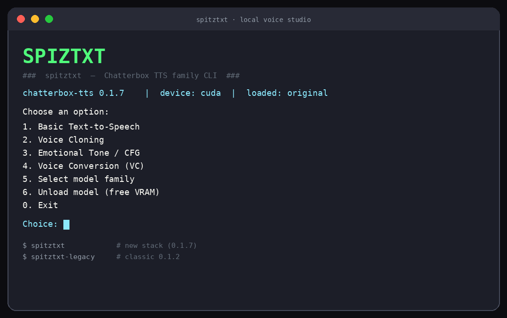

# 🎙️ spitztxt

**Local voice studio** — zero-shot voice cloning, expressive TTS, Turbo, Multilingual, and voice conversion. Powered by [ResembleAI Chatterbox](https://github.com/resemble-ai/chatterbox), wrapped in a friendly terminal UI.

[](https://github.com/Reperion/spitztxt)
[](https://www.python.org/)
[](https://pypi.org/project/chatterbox-tts/)
[](LICENSE)
[](https://pytorch.org/)

> **What is this for?**  
> Drop a few seconds of clean speech (KITT, Morgan, *your* voice, a character…), type any line, and get a high-quality WAV out — **on your own GPU**, no cloud API, no fine-tuning.  
> Built for makers, video/audio experiments, local agents, and anyone who wants **fast iteration** on cloned / emotional speech.

Formerly tracked as [Reperion/Chatterbox](https://github.com/Reperion/Chatterbox) (kept for history). **This repo is the active home.**

---

## ✨ The goal

| You want… | spitztxt gives you… |
|-----------|---------------------|
| 🎤 Clone a voice without training | Zero-shot clone from a short reference clip |
| 🎭 Control drama / pacing | `exaggeration` + `cfg_weight` (original / multilingual) |
| ⚡ Fast drafts | **Turbo** model path |
| 🌍 Other languages | **Multilingual** + `language_id` |
| 🔁 Re-voice existing audio | **Voice conversion** (source → target speaker) |
| 🖥️ Simple daily driver | Type `spitztxt` → menu · or flags for scripts |

---

## 📸 Terminal



```bash
spitztxt            # interactive menu (default stack ≥ 0.1.7)
spitztxt --version  # chatterbox-tts 0.1.7 | device cuda
```

---

## 🚀 Quick start (one command)

If you already have this machine set up (Mike’s lab):

```bash
spitztxt
```

| Command | What it runs |
|---------|----------------|
| **`spitztxt`** | **New stack** — `chatterbox-tts ≥ 0.1.7` (original · turbo · multilingual · VC) |
| **`spitztxt-legacy`** | Classic **0.1.2** interactive CLI (untouched, still available) |

Cold load of the default **original** model usually takes **~10–30s** (GPU). First use of Turbo / Multilingual may download multi‑GB weights from Hugging Face.

---

## 🛠️ Setup guide (fresh machine)

### Requirements

- Linux (WSL2 OK) · Python **3.12+**
- NVIDIA GPU + CUDA recommended (CPU works but is slow)
- Disk space for models (several GB after first download)

### 1. Clone

```bash
git clone git@github.com:Reperion/spitztxt.git
cd spitztxt
```

### 2. Create the new environment

```bash
python3 -m venv venv-0.1.7
source venv-0.1.7/bin/activate

# setuptools pin: resemble-perth needs pkg_resources
pip install -U pip 'setuptools>=70,<81'

# PyTorch with CUDA 12.4 (adjust for your platform — see https://pytorch.org)
pip install torch torchaudio --index-url https://download.pytorch.org/whl/cu124

pip install -r requirements.txt
```

### 3. Optional: `spitztxt` on your PATH

```bash
# example launcher in ~/bin
cat > ~/bin/spitztxt << 'EOF'
#!/usr/bin/env bash
set -e
REPO="${SPIZTXT_HOME:-$HOME/projects/spitztxt}"  # ← set your path
cd "$REPO"
exec "$REPO/venv-0.1.7/bin/python" "$REPO/spitztxt-CLI.py" "$@"
EOF
chmod +x ~/bin/spitztxt
```

Or from the repo:

```bash
./run_spitztxt.sh
./run_spitztxt.sh --version
```

### 4. Smoke test (optional)

```bash
spitztxt --smoke --smoke-dir output/smoke
# sequential: original · turbo · multilingual · VC  (VRAM-safe)
```

---

## 📖 User manual

### Interactive menu

| Key | Action |
|-----|--------|
| **1** | 🔊 Basic TTS (default voice of current family) |
| **2** | 🧬 Voice cloning (pick template # or path) |
| **3** | 🎭 Emotion / CFG (`exaggeration`, `cfg_weight`, …) |
| **4** | 🔄 Voice conversion (source audio → target voice) |
| **5** | 🧠 Switch model family (optional; menus also auto-switch) |
| **6** | 🧹 Unload model (free VRAM) — optional; not required when changing menus |
| **0** | Exit |

**Navigation:** type **`b`** (or `back`) at **any** submenu prompt to return to the main menu.

Voice templates live in **`voice-templates/`** (drop `.mp3` / `.wav` files there). Included examples: `kitt.mp3`, `kitt_clear.wav`, `morgan_cropped.mp3`.

### Auto model switching (you should not babysit VRAM)

Only **one** model family is kept in GPU memory at a time. Menus **switch for you**:

| You open… | If the wrong model is loaded… |
|-----------|--------------------------------|
| **2 Clone** | After **VC**, reloads your **last TTS** family (usually `original`) |
| **1 Basic TTS** | If Turbo/VC was loaded → switches to `original` (or last basic-capable family) |
| **3 Emotion** | Same — needs original/multilingual (not Turbo/VC) |
| **4 VC** | Loads the VC model automatically |

You’ll see a short line like `Switching model vc → original (unloads previous to free VRAM)…` then the load timer. **No need to use menu 6 first** unless you want to free VRAM while idle.

### Model families

| Family | `--model` | Best for | Notes |
|--------|-----------|----------|--------|
| **Original** | `original` | Quality clone + emotion | CFG & exaggeration supported |
| **Turbo** | `turbo` | Speed | Prompt **required** (>~5s). CFG / exaggeration / min_p **ignored** by library |
| **Multilingual** | `multilingual` | Non‑English / multi‑lang | Requires `language_id` (e.g. `en`) |
| **VC** | `vc` | Re-voice a recording | Needs `--source` + `--target` (no text) |

### Non-interactive CLI (scripts & automation)

```bash
# Version / stack check
spitztxt --version

# Original TTS
spitztxt --model original --text "Hello from spitztxt." -o output/hello.wav

# Clone
spitztxt --model original \
  --text "Knight Rider reporting." \
  --prompt voice-templates/kitt.mp3 \
  -o output/kitt.wav

# Emotion knobs
spitztxt --model original \
  --text "This is dramatic." \
  --prompt voice-templates/morgan_cropped.mp3 \
  --exaggeration 0.8 --cfg-weight 0.3 \
  -o output-emotion/drama.wav

# Turbo
spitztxt --model turbo \
  --text "Fast clone check." \
  --prompt voice-templates/morgan_cropped.mp3 \
  --temperature 0.7 --top-k 1000 \
  -o output-turbo/t.wav

# Multilingual
spitztxt --model multilingual \
  --text "Hello from multilingual spitztxt." \
  --language en \
  --prompt voice-templates/morgan_cropped.mp3 \
  -o output-multilingual/en.wav

# Voice conversion
spitztxt --model vc \
  --source output/hello.wav \
  --target voice-templates/kitt.mp3 \
  -o output-vc/vc.wav
```

### Useful knobs

| Flag | Used by | Role |
|------|---------|------|
| `--temperature` | original, turbo, mtl | Randomness / variation |
| `--cfg-weight` | original, mtl | Guidance strength (not Turbo) |
| `--exaggeration` | original, mtl | Emotional intensity (not Turbo) |
| `--top-p` / `--top-k` | turbo (+ top_p elsewhere) | Sampling |
| `--language` | multilingual | e.g. `en`, `nl`, `de`, … |
| `--no-norm-loudness` | turbo | Disable ref loudness norm |

### Reference audio tips 🎧

- Prefer **clean, single-speaker**, little music/reverb.
- **~6–10 seconds** is plenty for original (model hard-caps conditioners).
- Turbo needs the prompt **longer than ~5 seconds**.
- Longer files are truncated — **crop the best segment**, don’t feed a whole podcast.
- Quality of the clip beats “more minutes of audio.”

### Output folders

| Folder | Contents |
|--------|----------|
| `output/` | Basic TTS & original clones |
| `output-emotion/` | Emotion / CFG runs |
| `output-turbo/` | Turbo |
| `output-multilingual/` | Multilingual |
| `output-vc/` | Voice conversion |
| `errors/` | Timestamped logs |

---

## 🏗️ Architecture (short)

```
spitztxt-CLI.py     → menus + argparse + auto family switch
spitztxt_core.py    → load / generate / save (shared by CLI + tests)
venv-0.1.7/         → new stack (chatterbox-tts ≥ 0.1.7)
venv → …/chatterbox/venv   → legacy 0.1.2 (spitztxt-legacy only)
```

- **One model loaded at a time** (laptop GPU friendly). Entering a menu that needs another family unloads the previous one automatically.
- Menu **6** is optional (free VRAM while idle); you do **not** need it between Clone ↔ VC ↔ Emotion.
- Generation helpers are the **same code path** as the interactive UI — smokes and tests call `spitztxt_core`, not a parallel reimplementation.

---

## 🧪 Tests

```bash
venv-0.1.7/bin/python -m pytest tests/ -v
```

Structural tests are fast. GPU generate tests may take longer and need CUDA.

---

## 📦 Dual stack (legacy)

| Stack | Package | Launcher |
|-------|---------|----------|
| **Default** | `chatterbox-tts ≥ 0.1.7` | `spitztxt` |
| **Legacy** | `chatterbox-tts == 0.1.2` | `spitztxt-legacy` |

Legacy env is **not** upgraded in place. See `requirements-legacy.txt`.

---

## 🙏 Credits

- TTS / clone / VC models: **[Resemble AI — Chatterbox](https://github.com/resemble-ai/chatterbox)** (MIT)
- CLI & local workflow: **spitztxt** / Reperion

---

## 📄 License

Project packaging and CLI: use under the same spirit as Chatterbox (MIT-friendly).  
Model weights and third-party packages: see their respective licenses.  
Watermarking via Resemble Perth may be applied by the upstream library.

---

**Have fun.** Type `spitztxt`, pick a voice, make something weird. 🚀
